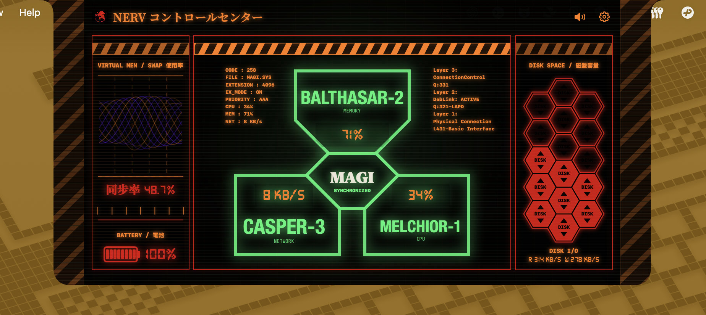

[English](README.md)

# NERV Notch

macOS 刘海悬浮岛，采用 NERV/MAGI 指挥终端美学风格。将实时 CPU、内存、网络、磁盘 I/O、Swap 和电池遥测数据嵌入 MacBook 刘海区域的浮动面板中。纯 Swift 编写，零第三方依赖。



## 功能

- **实时遥测** — CPU 使用率、内存、网络吞吐、磁盘空间与 I/O、Swap、电池
- **MAGI 三贤人裁决面板** — Melchior（CPU）、Balthazar（内存/网络）、Casper（磁盘/Swap）将原始指标送入 Central Dogma 共识引擎，输出颜色同步的裁决结果：绿色（正常）、橙色（提升警戒）、红色（紧急）
- **刘海常驻岛** — 紧凑模式嵌入物理刘海区域，作为低调的状态指示条；悬停约 1 秒或点击即可展开为完整 MAGI 控制台
- **仅点击模式** — 可关闭悬停展开，让 Island 仅响应鼠标点击
- **警戒线滚动动画** — 提升警戒和紧急状态下，三贤人面板背后斜纹警戒线滚动，各条线独立开关
- **NERV 启动动画** — 首次运行的 CRT 扫描线 + NERV 标志启动画面；可设置为每次启动都播放
- **背景音乐** — 控制台展开时播放可配置的环境音效
- **多屏幕适配** — 跟随 MacBook 物理刘海，无刘海显示器可模拟刘海
- **零依赖** — 仅使用 Apple 系统框架（AppKit、SwiftUI、Combine、Darwin）

## 系统要求

- macOS 13+
- 字体已内置于 App 中，无需用户单独安装

## 快速开始

```bash
./scripts/run-dev.sh
```

## 开发

```bash
# 构建
swift build

# 运行全部测试
swift test

# 运行单个测试
swift test --filter NotchGeometryTests/testNotchScreenRect

# 并行测试
swift test --parallel

# 代码覆盖率
swift test --enable-code-coverage
```

### 打包

```bash
# 本地自签名
./scripts/package-app.sh
open dist/NervNotch.app

# 正式签名发布
SIGNING_IDENTITY="Developer ID Application: Your Name (TEAMID)" \
  PRODUCT_BUNDLE_IDENTIFIER="com.example.NervNotch" \
  VERSION="0.1.0" BUILD_NUMBER="1" \
  ./scripts/package-app.sh
```

## 发布

推送版本标签即可触发 GitHub Actions 自动构建、签名、公证，生成 DMG 并上传为 draft release：

```bash
git tag v0.1.0
git push origin v0.1.0
```

也可在 Actions 页面手动触发。签名证书未配置时仍可生成未签名 DMG（本地使用）。

签名和公证所需 repository secrets 见 [`.github/workflows/release.yml`](.github/workflows/release.yml)：`MACOS_CERTIFICATE`、`MACOS_CERTIFICATE_PASSWORD`、`MACOS_SIGNING_IDENTITY`、`MACOS_KEYCHAIN_PASSWORD`、`APPLE_NOTARY_KEY`、`APPLE_NOTARY_KEY_ID`、`APPLE_NOTARY_ISSUER`。

## 架构

Swift 5.9，MVVM + 函数式核心。领域类型均为 `Sendable` + `Equatable` 值类型。SwiftUI 视图托管在 AppKit `NSPanel` / `NSWindow` 中。Combine 仅用于单条 `@Published` ↔ `sink` 绑定。

详细架构文档见 [`.planning/codebase/`](.planning/codebase/) — ARCHITECTURE.md、CONVENTIONS.md、TESTING.md 等。

## 许可

个人同人原型项目，不包含受版权保护的图像与音乐素材。
